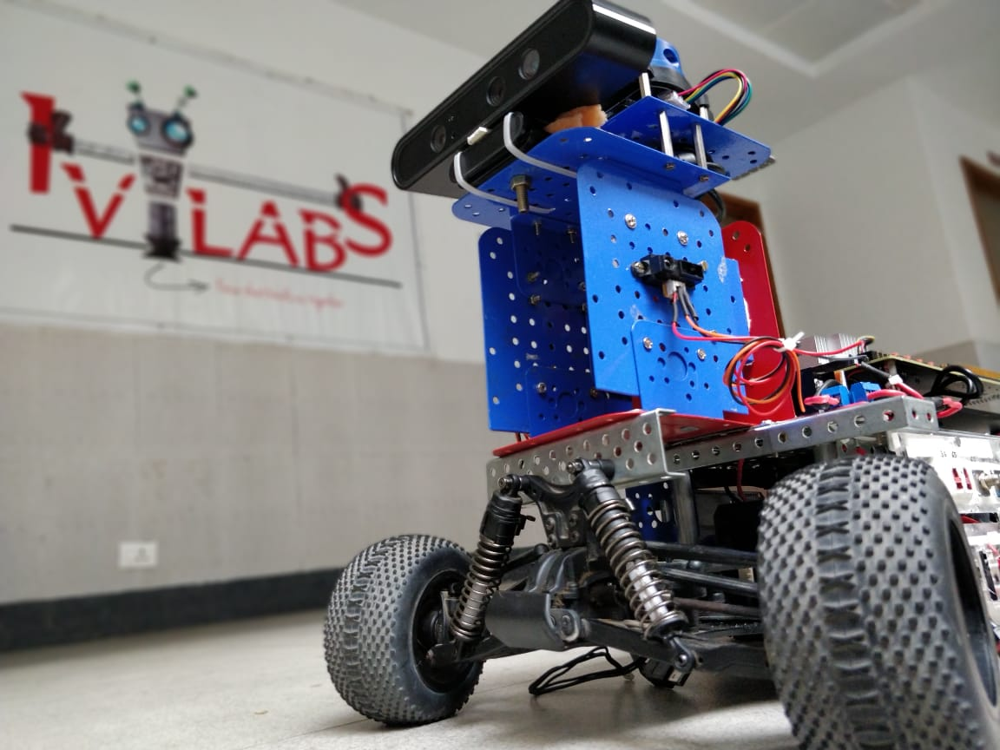

# Autonomous Delivery Robot [(Technical Report)](https://arxiv.org/abs/2103.09229)

This is the first version of IvLabs' autonomous driving platform. Built using the chassis of a racing grade 1/10th RC car, it can be used in outdoor road environments. It has additional sensors and components which enable perception, localization, planning and control for autonomous driving applications.

This project aims to accomplish A to B navigation with obstacle avoidance within our institute ([VNIT, Nagpur](http://www.vnit.ac.in)) campus.

### This repo will be updated soon to include installation and usage instructions
